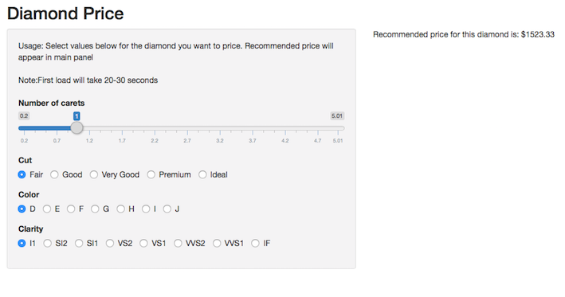

```{r, echo=FALSE, warning=FALSE, message=FALSE}
library(ggplot2)
```


## Introduction

The Diamond Pricing App can be used to help price a diamond based on the 4 C's, carat, cut, clarity and color.  The application can be found here: <https://jasonmurray.shinyapps.io/Diamonds/>

## Data {.smaller}
The data for the undrelying model was built with the diamond dataset in R.  It contains pricing and attributes for over 54,000 diamonds.  A GLM model was built in order to make predictions for the new input data. Data range/types shown below.

```{r}

range(diamonds$carat)
levels(diamonds$cut)
levels(diamonds$color)
levels(diamonds$clarity)

```


## Application 

Here is what the application interface looks like: 



